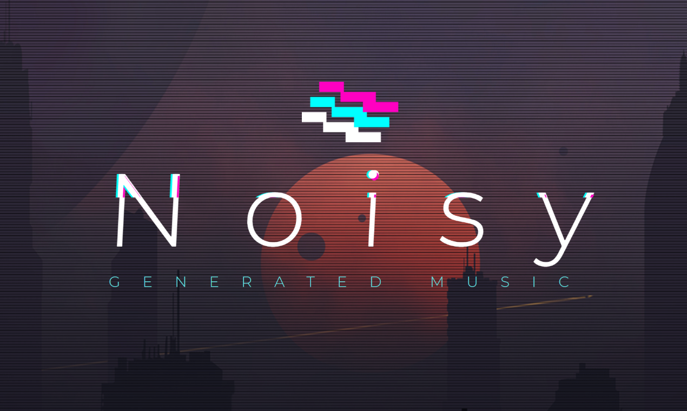
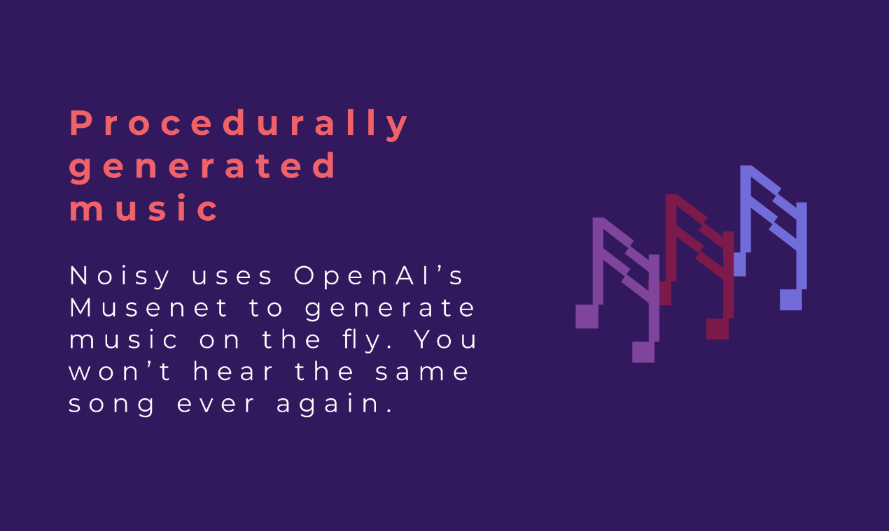
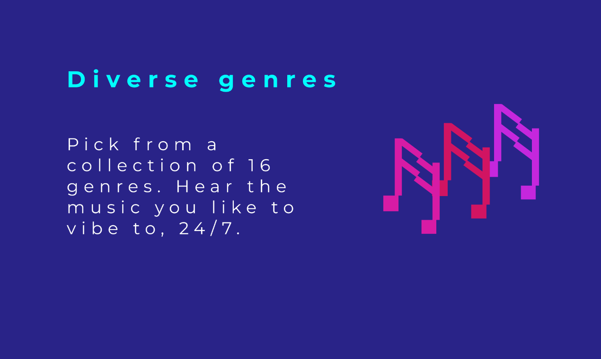
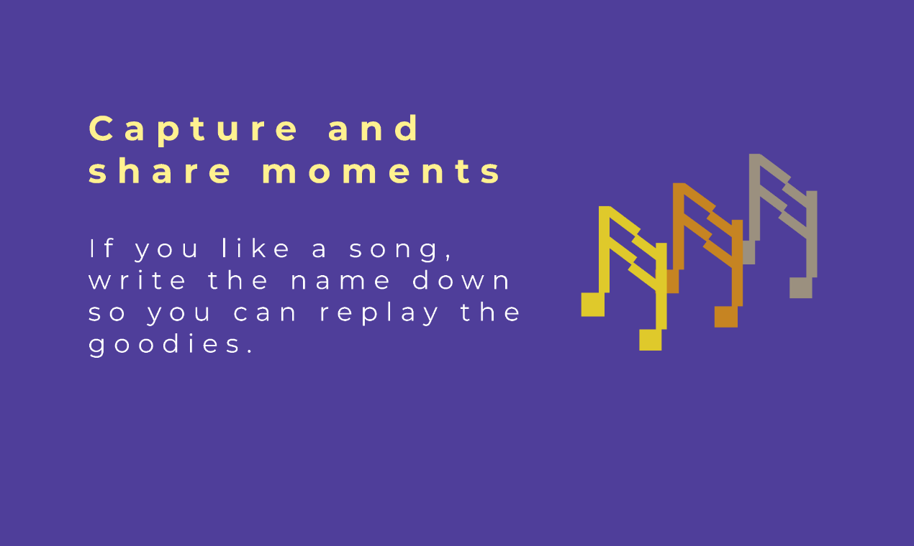

# Noisy

[Noisy](https://noisy.live) is a Discord bot that uses OpenAI’s Musenet to generate music on the fly. Listen with friends to a diverse set of 16 genres, ranging from Mozart to Lady Gaga. The goal is to create quality music for social situations, without needing to worry about playlists, URLs, or copyright infringements. Every song is unique and will only be played once.

Check it out at https://noisy.live






This code powers noisy.live's Discord bot. Let us know if you'd like to view the code for the website, backend or Musenet Generator.

### Usage example


## Feature Requests and Bug Reports

If you have any suggestions, we'd love to [hear your feedback](https://github.com/JonathanXu1/noisy-bot/issues/new/choose) and improve the bot to maximise happiness! Note: we're using Github issues, so you may need to create a Github account first before being able to fill feature requests and bug reports.

## How It Works

We generate new songs of a given genre by querying Musenet with the appropriate parameters. For each genre we store a list of available songs, and when the song currently being played is near the end of that list we query Musenet for new songs to add to the list. New songs are generated with beginnings identical to the endings of the most recent song in the given genre, so that we create relatively continuous sequences of songs which eventually diverge far from their starting points.

## Contributors

We built this bot! Hope you like it :D

If you have any questions or concerns about the bot (security, privacy, data, features) that need to be addressed privately, you can directly message any one of us at the contacts listed on our profiles.

[Jonathan Xu](https://github.com/JonathanXu1)
[Ricky Mao](https://github.com/rickrm)
[Vincent Huang](https://github.com/vincenthuang75025)
[Aaron Abraham](https://github.com/aaronabraham311)

## Special thanks

- Dmitri Brereton
- Chris Axon
- kvacm (for the background: https://www.deviantart.com/kvacm/art/Moons-743143427)

<!--
----------------------------------Noisy Developer Documentation--------------------------------------

## Local development

We do local development for Noisy on a test bot. It is not the same as the production Noisy bot. On the Noisy Discord server, you can see both bots on the sidebar.

Currently, our modules expect you to have a NodeJS version of at least 12. Install it [here](https://nodejs.org/en/download/)

First, you need to get the `.env` file from one of the project contributors. The env file contains the bot token for Noisy-test. After, you can run the bot locally and it will be live on localhost:3002. To run the bot locally, you only need to follow the commands below.

```
yarn
heroku local
```

The token for production is different, and is on Heroku as config vars, and it is used by builds to the Github master branch.

## Pushing to production

When you are sure the local version has your updates, and is working, you can push the code to production.  We have turned off automatic deploys to Heroku because minor Github pushes will cause the dyno to restart and break instances of the bot that are currently on servers. Steps to deploy to production:

1. Stage and commit your changes
2. Push to the main branch
3. On the Heroku dashboard, manually deploy the main Github branch. If you do not have access to the Heroku dashboard, contact a developer who does.

 -->
